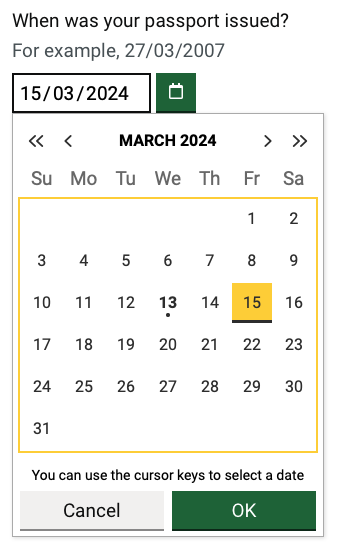

# GOV.UK React Date Picker Implementation User Guide

The GOV.UK Design System is an official design framework produced by the UK Government and defines best practices and rules that must be followed to ensure that your code base is GDS Compliant.

You can find the guide at the <a href="https://design-system.service.gov.uk/" target="_blank" rel="noreferrer">GOV.UK Design System</a> website.

## Overview

The standard implementation for the <a href="https://design-system.service.gov.uk/components/date-input/" target="_blank" rel="noreferrer">GDS Date input</a> uses three separate controls for day, month and year. User feedback indicated that this control did not support fast data entry due to the tabbing required between the components.

Standard <a href="https://developer.mozilla.org/en-US/docs/Web/HTML/Element/input/date" target="_blank" rel="noreferrer">HTML5 date inputs</a> provided fast data entry on desktop but the locale of the control is determined by the browser and additionally the control renders differently across different browsers, on mobile devices. Android and IOS now display calendars on a control touch, which did not allow easy entry of historic dates, which was often required by users.

The remit was to develop a react based date picker that would enable keyboard data entry similar to how the HTML5 control works on desktop, for both desktop and mobile, and also include an accessible calendar component that could be activated by the user.

The calendar part of this control has been implemented from the <a href="https://designsystem.gov.scot/components/date-picker" target="_blank" rel="noreferrer">Scottish Government Date Picker</a>, converting the original Javascript to React. The resulting component is shown below:



A working ([Demo](https://vite-react-gds-demo.netlify.app/)) can be found under the dates menu option, highlighting the differences between standard HTML5 date controls and the date picker implementation.

## Configuration

The below shows one of our example implementations of the date picker integrated with <a href="https://react-hook-form.com/" target="_blank" rel="noreferrer">React Hook Form</a>:

```js
<Controller
  control={control}
  name="datePicker"
  render={({ field: { value, onBlur, onChange }, fieldState: { error } }) => (
    <DatePicker
      identifier="datePicker"
      label="When was your passport issued?"
      hint="For example, 27/03/2007"
      width={InputWidth.Char10}
      multiQuestion={true}
      value={value}
      error={error?.message}
      onChange={x => onChange(x)}
      onBlur={onBlur}
    />
  )}
/>
```

## Installation

The package can be installed via [npm](https://github.com/npm/cli):

```
npm install react-govuk-datepicker --save
```

Or via [yarn](https://github.com/yarnpkg/yarn):

```
yarn add react-govuk-datepicker
```

## Accessibility

### Keyboard support for Input

- _Left_: Move to the previous date part section e.g.: move from month to day.
- _Right_: Move to the next date part section e.g.: move from day to month.
- _Up_: Increment the currently selected date part section.
- _Down_: Decrement the currently selected date part section.

### Keyboard support for Calendar

- _Left_: Move to the previous day.
- _Right_: Move to the next day.
- _Up_: Move to the previous week.
- _Down_: Move to the next week.
- _PgUp_: Move to the previous month.
- _Shift+PgUp_: Move to the same day and month of the previous year
- _PgDn_: Move to the next month.
- _Shift+PgDn_: Move to the same day and month of the next year
- _Home_: Move to the first day of the current week.
- _End_: Move to the last day of the current week.

## License

Copyright (c) 2024 Barry Jacobs and individual contributors. Licensed under MIT license, see [LICENSE](LICENSE) for the full license.
